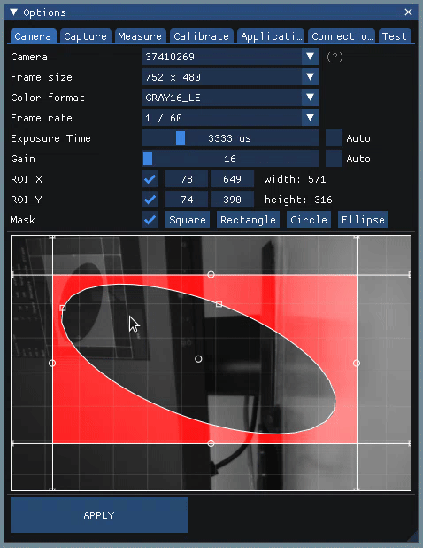

# imgui_canvas

This is an addon for [imgui](https://github.com/ocornut/imgui). It provides a canvas, with ability to draw basic shapes, (square, rectangle, circle, ellipse, horizontal lines, vertical lines) It also provides functionality to use the shapes as masks. See imgui_canvas_demo.cpp for usage examples. Update IMGUI_DIR Makefile to compile.

[imgui_canvas](https://kuravih.github.io/imgui_canvas/)

